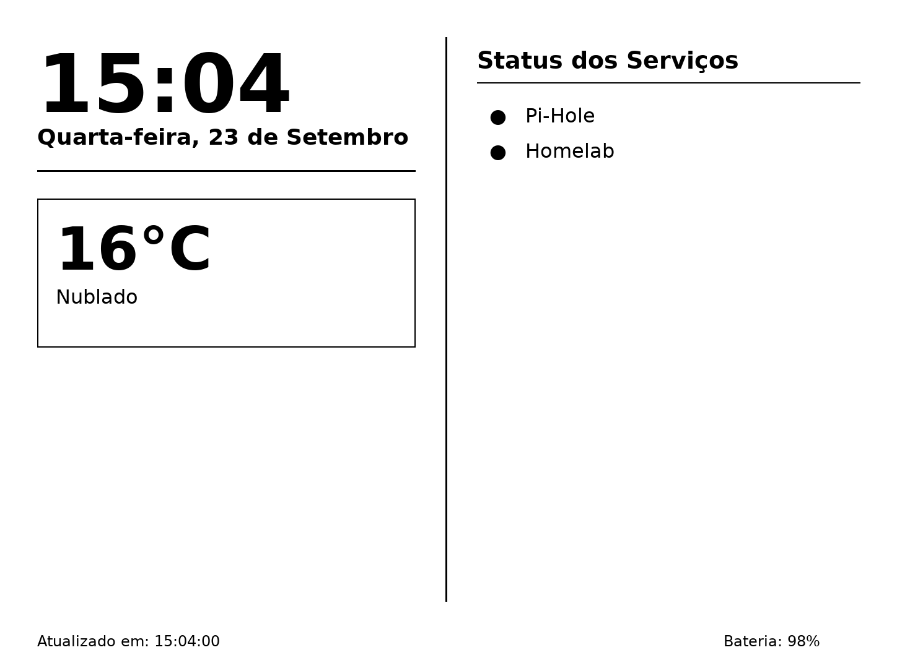

# kindle-dashboard

# 📖  Kindle Dashboard Paperwhite (Docker Edition)
Um dashboard digital otimizado para a tela E-ink da **Amazon Kindle Paper White (11ª geração)**. Exibe relógio, data, clima em tempo real e status de serviços do homelab (caso você tenha um e queira exibir o status), com atualização automática a cada minuto via API HTTP em um container docker. Perfeito para quem tem um homelab ou servidor dedicado a serviços.




## ✨ Características
- 🕒 **Relógio & Data**: Formato nativo em português (`Segunda-feira, 15 de Março`)
- 🌤️ **Clima em tempo real**: Consulta para seu estado ou cidade (latitude, longitude) via API Open-Meteo com cache de 15 min
- 🔌 **Monitoramento de serviços**: Verifica disponibilidade dos serviços locais via endpoints HTTP
- 🔋 **Leitura da bateria**: Captura o parâmetro `?battery=XX` enviado pelo app Kindle e exibe no dashboard
- 📱 **Formato E-ink nativo**: Imagem monocromática 8-bit (`L`) em orientação paisagem (1448×1072)
- ⏱️ **Atualização síncrona**: Loop alinhado ao início de cada minuto para evitar janelas de atualização fora da hora
- 🚫 **Cache desativado**: Headers `no-store` e troca atômica de arquivos garantem sempre uma imagem atualizada


## 🛠 Instalação e Execução
1. Clone o repositório:
```sh
   git clone https://github.com/OverloadMX/kindle_dashboard.git
   cd kindle_dashboard
```
2. Instale Docker e Docker Compose (v2+).
3. Rode o serviço com compose:
```sh
   docker compose up --build
```
4. No script `dashboard.sh, configure a **URL de leitura** a seguir. A URL serve para testar se o container está funcionando através de um navegador:
```
   http://<IP_DO_CONTAINER>:8081/kindle-dashboard.png?battery=XX
```
> `XX` deve ser o valor atual da bateria do Kindle. O servidor captará esse valor e gravará no disco para exibir no próximo frame.

5. Dependendo do Jailbreak que foi feito no Kindle, o SSH é configurado dentro do KOReader (IP e porta aparecerá para acesso). Caso essa etapa já está configurada:

- acesse o Kindle via SSH: 
```bash
ssh -p <PORTA> root@<SEU_IP>
```

- Monte o sistema para escrita
```bash
mntroot rw
```

- Crie o arquivo dashboard.sh com as informações do IP do servidor (edite o arquivo colocando o IP do container)
```bash
cat << 'EOF' > /mnt/us/dashboard.sh
#!/bin/sh

SERVER_URL="http://<SEU_IP_DO_SERVIDOR>:8081/kindle-dashboard.png"
IMAGE_PATH="/tmp/dashboard.png"
COUNT=0
REFRESH_EVERY=10

# 1. Desativa proteções de tela nativas e suspensão automática
lipc-set-prop -i com.lab126.powerd preventScreenSaver 1 2>/dev/null
lipc-set-prop -i com.lab126.powerd deferSuspend 1 2>/dev/null
lipc-set-prop -i com.lab126.powerd flWorkflow 0 2>/dev/null

# 2. Para o Framework Java (remove a tela inicial da Amazon)
stop framework 2>/dev/null || /etc/init.d/framework stop 2>/dev/null

iwconfig wlan0 power off 2>/dev/null

ntpdate -u pool.ntp.br 2>/dev/null || ntpdate -u time.google.com 2>/dev/null &

# 3. Dá 2 segundos para o display liberar e limpa a tela
sleep 2
eips -c
usleep 250000

while true; do
    # Garante periodicamente que a proteção de tela não seja reativada
    lipc-set-prop -i com.lab126.powerd preventScreenSaver 1 2>/dev/null

    # Coleta bateria
    BATT=$(lipc-get-prop -i com.lab126.powerd battLevel 2>/dev/null)
    if [ -z "$BATT" ]; then
        BATT=$(cat /sys/devices/system/yoshi_battery/yoshi_battery0/battery_capacity 2>/dev/null || cat /sys/class/power_supply/battery/capacity 2>/dev/null)
    fi

    # Baixa e estampa no e-ink
    curl -s -f -o "$IMAGE_PATH" "${SERVER_URL}?battery=${BATT:-100}"

    if [ $? -eq 0 ]; then
        if [ $((COUNT % REFRESH_EVERY)) -eq 0 ]; then
            eips -c
            usleep 250000
        fi
        eips -g "$IMAGE_PATH"
        COUNT=$((COUNT + 1))
    fi

    # Sincroniza virada do minuto
    CURRENT_SEC=$(date +%S | sed 's/^0*//')
    [ -z "$CURRENT_SEC" ] && CURRENT_SEC=0
    SLEEP_TIME=$((61 - CURRENT_SEC))

    sleep $SLEEP_TIME
done
EOF
```

- Crie o arquivo dashboard.conf

```bash
cat << 'EOF' > /etc/upstart/dashboard.conf
description "Kindle Dashboard Auto Start"

start on framework_ready
stop on stopping system

script
    # Trava de seguran..a: se existir este arquivo na raiz, aborta
    if [ -f /mnt/us/STOP_DASHBOARD ]; then
        exit 0
    fi

    # Aguarda o Wi-Fi se associar .. rede
    sleep 15

    chmod +x /mnt/us/dashboard.sh
    exec /bin/sh /mnt/us/dashboard.sh
end script
EOF
```

## 🧠 Como Funciona
| Componente | Responsabilidade |
|------------|------------------|
| `dashboard_kindle.py` | Gera a imagem em modo `"L"` (8-bit), consulta APIs, desenha texto/elementos e salva em `/output/kindle-dashboard.png` |
| `server.py` | HTTP server leve que serve o arquivo, processa o parâmetro `?battery=XX`, bloqueia cache e retorna a imagem |
| `Dockerfile` | Base `python:3.11-slim`, instala dependências (`pillow`, `requests`) e configura executável composto |
| `docker-compose.yml` | Orquestra o serviço, expõe o porto 8081 (mapeado para 8080 internamente), define volume persistente e timezone |
| dashboard.sh | Script para capturar as imagens e informações do servidor HTTP e exibi-las na tela do Kindle. Além de limitar algumas funcionalidades de exibição da tela inicial do aparelho (Framework Java), suspensão automática e proteção de tela. Acesse o Kindle com SSH, salve este arquivo na raiz do Kindle (/mnt/us) e dê permissões de execução `chmod +x /mnt/us/dashboard.sh` Obs.: No SSH, para dar permissões de gravação no Kindle, use o comando mntroot rw|
| dashboard.conf | Arquivo para executar o dashboard.sh sempre quando o Kindle for iniciado. Sempre que precisar para o script para qualquer finalidade, plugue o Kindle no PC ou laptop, e crie um arquivo em branco chamado STOP_DASHBOARD. Acesse o Kindle via SSH e salve este arquivo no caminho /etc/upstart/|


## ⚙️ Customização Rápida
- **Mudar coordenadas do clima**: Edite `lat` e `lon` em `dashboard_kindle.py`
- **Adicionar/remover serviços**: Modifique a lista `targets` na função `check_service_status()`
- **Fontes customizadas**: Atualize os caminhos em `FONT_PATH_BOLD` / `FONT_PATH_REGULAR` (fontes DejaVu são incluídas pela imagem Docker)
- **Frequência de atualização**: Ajuste a variável `sleep_seconds` ou o loop no `main()`


## 📦 Requisitos
- Python 3.11+
- Docker Engine ≥ 20.10
- Docker Compose ≥ 2.0
- Fontes DejaVu Sans (incluídas automaticamente na imagem Docker)
- Kindle com Jailbreak e SSH (Esta etapa depende muito da versão do firmware ou modelo do Kindle, para este projeto foi utilizado jailbreak [Nosebleed](https://kindlemodding.org/jailbreaking/Nosebleed/) e o SSH do KOReader).

## 📜 Licença
Este projeto é distribuído sob a [Licência MIT](https://opensource.org/licenses/MIT).
